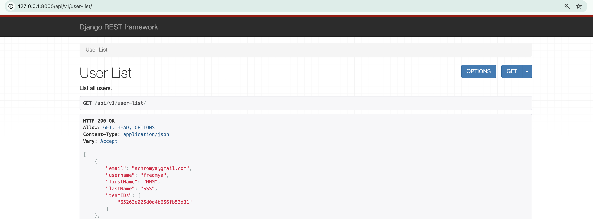

# Setting Mongo with Django

**2/6/2024 • Mya Schroder**

Django has a built in ORM (Object Relational Manager). However, it is designed for SQL-like databases and doesn't work with MongoDB. This means features like the Admin Panel won't work. However, there are 3 library options for using Mongo with Django (aka Python):

1. Djongo

   - Attempts to map Mongo to Django's built in ORM.
   - Not supported any more and does not work with recent versions of Django.

2. Pymongo

   - Low level MongoDB driver.
   - Officially supported by MongoDB.

3. MongoEngine
   - Built off of Pymongo to be higher level.
   - Enforces schemas and data integrity.

I decided to go with MongoEngine because it is currently supported and enforces data integrity.

### Mongo Example

For testing, I implemented a list-user API route that shows all the user data in the database. You can see the data by starting the server and going to [http://127.0.0.1:8000/api/v1/user-list/](http://127.0.0.1:8000/api/v1/user-list/).  

Here is what had to be implemented to do that:

```py
# api/models.py

import mongoengine as mongo

class User(mongo.Document):
    email = mongo.EmailField(required=True)
    username = mongo.StringField(required=True)
    firstName = mongo.StringField()
    lastName = mongo.StringField()
    teamIDs = mongo.ListField(mongo.ObjectIdField())
    meta = {
        'collection': 'User', # Need to specify UPPER Case
        'strict': False  # If true, throws weird error for __v
        }  

```

```py
# api/serializers.py

from rest_framework import serializers
from .models import User

class UserSerializer(serializers.Serializer):
    email = serializers.EmailField()
    username = serializers.CharField(max_length=100)
    firstName = serializers.CharField(max_length=100, allow_blank=True, required=False)
    lastName = serializers.CharField(max_length=100, allow_blank=True, required=False)
    teamIDs = serializers.ListField(child=serializers.CharField(), required=False)

```

```py
# api/views.py

from rest_framework.views import APIView
from rest_framework.response import Response
from .models import User
from .serializers import UserSerializer
import mongoengine as mongo
from dotenv import load_dotenv
import os


def connect_database():
    # Load environment variables from .env file
    load_dotenv()
    username = os.getenv('MONGO_USERNAME')
    password = os.getenv('MONGO_PASSWORD')
    hostname = "quayside-cluster.ry3otj1.mongodb.net"
    database = "quayside"

    connection_string = f"mongodb+srv://{username}:{password}@{hostname}/{database}?retryWrites=true&w=majority"
    # No good way to tell if connection exists besides this try/except
    try:
        mongo.get_connection(alias='default')
    except Exception as e:
        # If an exception is raised, no connection could be retrieved so create one
        mongo.connect(db=database, host=connection_string)
    

class UserListView(APIView):
    """
    List all users.
    """

    def get(self, request, format=None):
        connect_database()
        users = User.objects.all()
        serializer = UserSerializer(users, many=True)
        return Response(serializer.data)
```

```py
# quayside/urls.py

from django.urls import path, include
from .views import index
from api.views import UserListView

urlpatterns = [
    path('', index, name='index'),
    path("api/v1/user-list/", UserListView.as_view(), ),
] 
```


Citations: <br>
[Read This Before Using Django With MongoDB](https://www.mongodb.com/compatibility/mongodb-and-django) <br>
[How to Use Django with MongoDB](https://www.mongodb.com/compatibility/mongodb-and-django) <br>
ChatGPT
